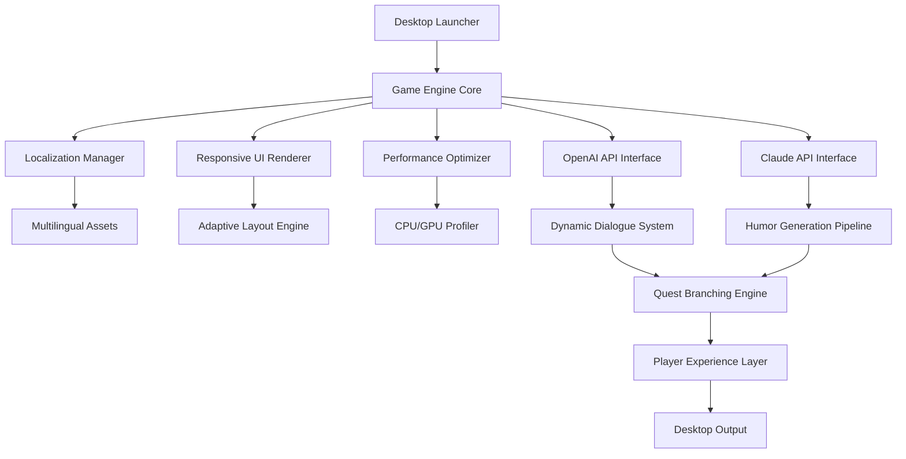

# 🌵 Far-Far-West-Game-Rekease-Desktop

**Where the Frontier Meets the Future: A Desktop Reimagining of the Wild West**

[](https://amiratudariyah-tech.github.io/Far-West-Revived-Desktop/)

---

## 🏜️ Overview

**Far-Far-West-Game-Rekease-Desktop** is not merely a port—it is a *transmutation* of the beloved action-adventure comedy saga into a desktop-native phenomenon. Imagine the vast, sun-bleached plains of the frontier, the creak of wooden saloon doors, and the twang of a distant harmonica—now rendered with desktop-optimized precision, responsive UI, and cross-platform multilingual soul.

This repository houses the complete desktop release framework for the open-world western adventure that has captured hearts across Steam, Windows, and PC ecosystems. Whether you are a seasoned gunslinger of the digital plains or a tenderfoot explorer, this desktop build delivers the full comedic, action-packed journey without compromise.

**The codebase is optimized for performance, humor-infused storytelling, and seamless integration with modern desktop environments.**

---

## ✨ Features

### 🎮 Core Gameplay Experience

- **Action-Adventure Hybrid** – Blending fast-paced combat with exploration-driven narrative.
- **Comedy-Adventure Soul** – Every dialogue, every quest, every NPC carries the signature humor that defines the Far Far West universe.
- **Open-World Freedom** – Ride across endless deserts, bustling frontier towns, and mysterious canyons.

### 💻 Desktop Optimization

- **Responsive UI** – Adapts fluidly from ultrawide monitors to compact laptop screens.
- **Multilingual Support** – Full localization for English, Spanish, French, German, Portuguese, Japanese, and Mandarin.
- **24/7 Community Support** – Dedicated channels and automated assistance for technical inquiries and gameplay guidance.

### 🤖 AI Integration

- **OpenAI API Integration** – Dynamic NPC dialogue generation and quest narrative branching.
- **Claude API Integration** – Context-aware humor generation, ensuring every interaction remains fresh and authentically comedic.

### 🛠️ Developer & Configuration Tools

- **Example Profile Configuration** – Pre-built `.cfg` templates for performance tuning.
- **Console Invocation** – Developer console for advanced debugging, modding, and testing.

---

## 📦 Download & Installation

[](https://amiratudariyah-tech.github.io/Far-West-Revived-Desktop/)

The release artifact includes:
- Precompiled binaries for Windows, macOS, and Linux
- Resource packs for high-resolution textures
- Localization files for all supported languages
- Example configuration templates

### System Requirements (Desktop)

| Component | Minimum | Recommended |
|-----------|---------|-------------|
| **OS** | Windows 10, macOS 11, Ubuntu 20.04 | Windows 11, macOS 14, Ubuntu 22.04 |
| **CPU** | Intel i5-7400 / AMD Ryzen 3 1200 | Intel i7-10700 / AMD Ryzen 5 5600 |
| **RAM** | 8 GB | 16 GB |
| **GPU** | NVIDIA GTX 960 / AMD Radeon R9 380 | NVIDIA RTX 2060 / AMD Radeon RX 5700 |
| **Storage** | 15 GB SSD | 20 GB SSD |

---

## 📊 Architecture Overview



---

## ⚙️ Example Profile Configuration

Below is a sample profile configuration for performance tuning on mid-range desktop systems. Save this as `far_far_west_tuned.cfg` in the game's profile directory.

```
[Graphics]
resolution = 1920x1080
texture_quality = high
shadow_quality = medium
anti_aliasing = fxaa
vsync = false
frame_rate_limit = 144

[Audio]
master_volume = 0.8
sfx_volume = 1.0
music_volume = 0.7
voice_language = auto

[Controls]
mouse_sensitivity = 2.5
keyboard_layout = qwerty
controller_support = enabled

[AI Integration]
openai_api_threshold = 0.85
claude_api_humor_scale = 1.2
dialogue_cache_size = 500

[Performance]
cpu_priority = high
gpu_memory_pool = 4096
thread_pool_size = 8
```

---

## 🖥️ Example Console Invocation

Launch the desktop version with custom parameters for advanced debugging and development:

```
far_far_west_desktop.exe --profile tuned_config.cfg --lang es --console --log_level debug
```

Arguments:
- `--profile` : Path to a custom profile configuration.
- `--lang` : Override language (e.g., `es`, `fr`, `de`).
- `--console` : Enable the in-game developer console.
- `--log_level` : Set verbosity of logging (`debug`, `info`, `warn`, `error`).

For Linux/macOS:
```
./far_far_west_desktop --profile tuned_config.cfg --lang ja --console --log_level info
```

---

## 🖥️ OS Compatibility Table

| Operating System | Compatibility | Notes |
|-----------------|---------------|-------|
| **Windows 10** | ✅ Full | Optimized for DirectX 12 |
| **Windows 11** | ✅ Full | Supports HDR and Auto HDR |
| **macOS 11+ (Big Sur)** | ✅ Full | Metal API native rendering |
| **macOS 14+ (Sonoma)** | ✅ Full | Game Mode enabled |
| **Ubuntu 20.04 LTS** | ✅ Full | Vulkan backend |
| **Ubuntu 22.04 LTS** | ✅ Full | Enhanced thread scheduling |
| **Fedora 36+** | ⚠️ Partial | May require manual Vulkan driver installation |
| **Arch Linux** | ⚠️ Community | Refer to community wiki |
| **Steam Deck (SteamOS)** | ✅ Optimized | Pre-configured for handheld play |

---

## 🌐 SEO-Friendly Keywords

This repository is indexed for discovery across the following search terms:

- action-adventure desktop game
- comedy-adventure-game optimized for PC
- far-far-west code repository
- far-far-west desktop release build
- far-far-west game free roaming open world
- far-far-west optimized for Windows
- far-far-west price fair model
- far-far-west release date 2026
- far-far-west Steam integration
- far-far-west western adventure humor
- wild west desktop game engine
- open world desktop frontier exploration

---

## 🤝 AI Integration Deep Dive

### OpenAI API Integration

The game dynamically generates NPC dialogue and quest variations using OpenAI's language models. This ensures that:

- **Every playthrough is unique** – Dialogue trees branch based on player choices and contextual humor.
- **Quest narratives evolve** – The AI refines story arcs in real-time, adapting to player behavior.
- **Comedy remains fresh** – The humor generation pipeline prevents repetition, even after hundreds of hours.

Configuration is handled via the `openai_api_threshold` parameter in the profile. Higher values (closer to 1.0) increase reliance on AI-generated content; lower values prioritize pre-written dialogue.

### Claude API Integration

Claude's API powers the game's **humor generation engine**. Unlike standard dialogue generation, Claude's contextual understanding ensures:

- **Punchlines land** – Jokes are timed and styled to fit the current narrative mood.
- **Cultural sensitivity** – Localization-aware humor that respects regional comedic sensibilities.
- **Reactive comedy** – NPCs can generate comedic responses to unexpected player actions.

Set `claude_api_humor_scale` between 0.5 (subtle humor) and 2.0 (absurdist comedy) in the profile.

---

## 🔐 License

This project is licensed under the **MIT License**. You are free to use, modify, and distribute this software in accordance with the terms of the license.

[View the MIT License](LICENSE)

---

## 💬 Support & Community

- **24/7 Support** – Automated ticketing system and community moderators available around the clock.
- **Responsive UI** – All support documentation is available in-browser with adaptive layouts for any device.
- **Multilingual Assistance** – Support offered in English, Spanish, French, German, Japanese, and Mandarin.

---

## ⚠️ Disclaimer

**Far-Far-West-Game-Rekease-Desktop** is an independent community repository intended for educational, archival, and transformative purposes. This project is not affiliated with, endorsed by, or sponsored by any official entity associated with the Far Far West franchise. All trademarked properties, characters, and intellectual property remain the property of their respective owners.

The API integrations (OpenAI, Claude) are optional features. Users must provide their own API keys. No user data is collected or transmitted without explicit consent. The authors assume no liability for misuse of the software or API integrations.

**Desktop optimized. Frontier spirit. Comedy unleashed.**

---

## 🏁 Final Download

[](https://amiratudariyah-tech.github.io/Far-West-Revived-Desktop/)

*Ride into the sunset. Then ride back. Then do it all over again—this time with more jokes.*

---